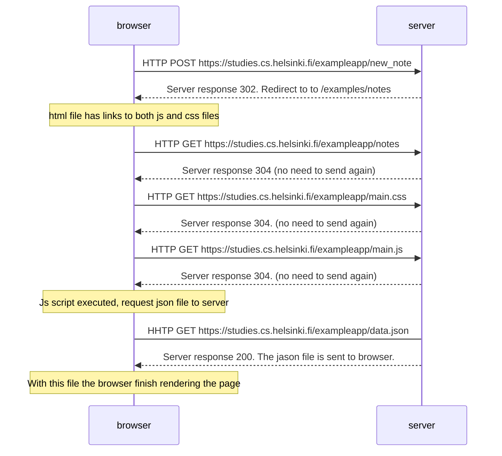

Asuming the page is already loaded:

```mermaid
sequenceDiagram
    participant browser
    participant server

    browser->>server: HTTP POST https://studies.cs.helsinki.fi/exampleapp/new_note
    server-->>browser: Server response 302. Redirect to to /examples/notes

    Note over browser: html file has links to both js and css files

    browser->>server: HTTP GET  https://studies.cs.helsinki.fi/exampleapp/notes
    server-->>browser: Server response 304 (no need to send again)

    browser->>server: HTTP GET  https://studies.cs.helsinki.fi/exampleapp/main.css
    server-->>browser: Server response 304. (no need to send again)
    
    browser->>server: HTTP GET  https://studies.cs.helsinki.fi/exampleapp/main.js
    server-->>browser: Server response 304. (no need to send again)

    Note over browser: Js script executed, request json file to server

    browser ->server: HHTP GET https://studies.cs.helsinki.fi/exampleapp/data.json
    server-->>browser: Server response 200. The jason file is sent to browser.

    Note over browser: With this file the browser finish rendering the page


    

```
