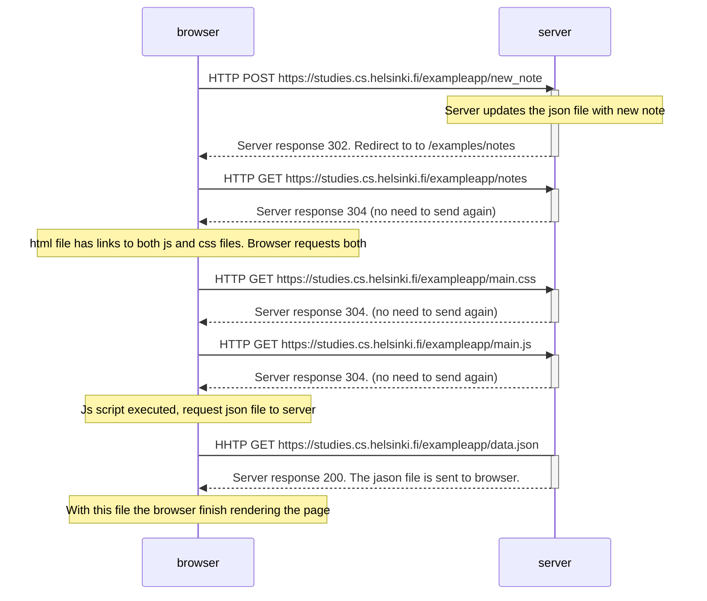

Asuming the page is already loaded, this would be after pressing "Save" button

```mermaid
sequenceDiagram
    participant browser
    participant server

    browser->>server: HTTP POST https://studies.cs.helsinki.fi/exampleapp/new_note    
    activate server
    Note over server: Server updates the json file with new note
    server-->>browser: Server response 302. Redirect to to /examples/notes
    deactivate server


    browser->>server: HTTP GET  https://studies.cs.helsinki.fi/exampleapp/notes
    activate server
    server-->>browser: Server response 304 (no need to send again)
    deactivate server
    Note over browser: html file has links to both js and css files. Browser requests both

    browser->>server: HTTP GET  https://studies.cs.helsinki.fi/exampleapp/main.css
    activate server
    server-->>browser: Server response 304. (no need to send again)
    deactivate server

    browser->>server: HTTP GET  https://studies.cs.helsinki.fi/exampleapp/main.js
    activate server
    server-->>browser: Server response 304. (no need to send again)
    deactivate server

    Note over browser: Js script executed, request json file to server

    browser ->server: HHTP GET https://studies.cs.helsinki.fi/exampleapp/data.json
    activate server
    server-->>browser: Server response 200. The jason file is sent to browser.
    deactivate server

    Note over browser: With this file the browser finish rendering the page


    

```
