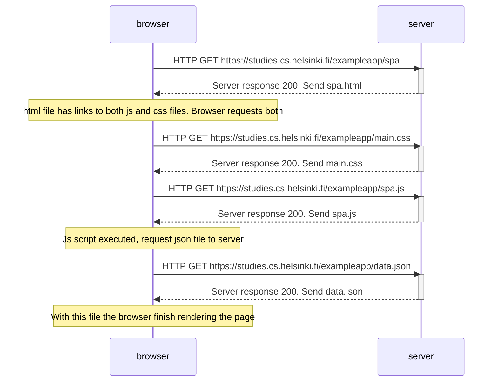

```mermaid
sequenceDiagram
    participant browser
    participant server

    browser->>server: HTTP GET https://studies.cs.helsinki.fi/exampleapp/spa
    activate server
    server-->>browser: Server response 200. Send spa.html
    deactivate server
    
    Note over browser: html file has links to both js and css files. Browser requests both

    browser->>server: HTTP GET https://studies.cs.helsinki.fi/exampleapp/main.css
    activate server
    server-->>browser: Server response 200. Send main.css
    deactivate server

    browser->>server: HTTP GET https://studies.cs.helsinki.fi/exampleapp/spa.js
    activate server
    server-->>browser: Server response 200. Send spa.js
    deactivate server

    Note over browser: Js script executed, request json file to server

    browser->>server: HTTP GET https://studies.cs.helsinki.fi/exampleapp/data.json
    activate server
    server-->>browser: Server response 200. Send data.json
    deactivate server
    Note over browser: With this file the browser finish rendering the page
```
Note, css and js file transfer happens almost at the same time, but css starts earlier
